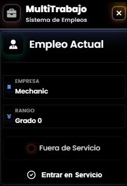

# 🏢 HZ MultiTrabajo - Sistema Avanzado de Gestión de Trabajos

<div align="center">
  
  
  [](https://fivem.net/)
  [](https://github.com/esx-framework/esx-legacy)
  []()
  [](LICENSE)
</div>

## 📋 Descripción

**HZ MultiTrabajo** es un sistema completo y moderno para la gestión de múltiples trabajos en servidores FiveM con framework ESX. Permite a los jugadores cambiar entre diferentes trabajos de manera intuitiva, gestionar su estado de servicio y visualizar estadísticas detalladas de tiempo trabajado.

### ✨ Características Principales

- 🎯 **Interfaz Moderna**: Diseño glassmorphism con efectos visuales avanzados
- 🔄 **Cambio Dinámico**: Intercambio fluido entre trabajos sin reiniciar
- 📊 **Estadísticas Detalladas**: Seguimiento de tiempo trabajado por trabajo
- 💰 **Información Salarial**: Visualización de salarios por grado
- 📱 **Responsive Design**: Adaptable a diferentes resoluciones
- 🎨 **Animaciones Suaves**: Transiciones y efectos visuales profesionales
- 📈 **Historial Completo**: Registro de todos los cambios de trabajo
- 🔔 **Notificaciones**: Sistema de alertas integrado

## 🚀 Instalación

### Requisitos Previos

- **FiveM Server** (Última versión)
- **ESX Legacy Framework** (v1.6.0+)
- **QBOX/QBCORE** (v1.6.0+)
- **MySQL/MariaDB** Database
- **ox_lib** (Opcional, para funciones adicionales)

### Pasos de Instalación

1. **Descarga el recurso**
   ```bash
   git clone https://github.com/hazteunsitio/hz-multitrabajo.git
   ```

2. **Coloca en tu servidor**
   ```
   resources/[standalone]/hz-multitrabajo/
   ```

3. **Configura la base de datos**
   - El script creará automáticamente las tablas necesarias
   - Asegúrate de que tu base de datos ESX esté funcionando

4. **Añade al server.cfg**
   ```cfg
   ensure hz-multitrabajo
   ```

5. **Reinicia el servidor**
   ```bash
   restart hz-multitrabajo
   ```

## ⚙️ Configuración

### Personalización del Logo

1. Reemplaza el archivo `html/logo.png` con tu logo personalizado
2. Dimensiones recomendadas: **512x512px** (formato PNG)
3. El logo se redimensionará automáticamente a 55x55px

### Comandos Disponibles

| Comando | Descripción | Permisos |
|---------|-------------|----------|
| `/trabajos` | Abre el menú de trabajos | Todos los jugadores |
| `/multijob` | Alias para `/trabajos` | Todos los jugadores |
| `/jobmenu` | Alias alternativo | Todos los jugadores |

### Teclas de Acceso

- **F6** - Abrir/Cerrar menú de trabajos (configurable)
- **ESC** - Cerrar menú
- **Enter** - Confirmar selección

## 🎨 Características de la Interfaz

### Diseño Visual

- **Glassmorphism**: Efectos de cristal con blur y transparencias
- **Gradientes Dinámicos**: Colores que cambian según el contexto
- **Animaciones CSS**: Transiciones suaves y efectos hover
- **Iconografía**: Font Awesome 6.0 para iconos modernos
- **Tipografía**: Google Fonts (Poppins) para mejor legibilidad

### Funcionalidades Interactivas

- **Cambio de Trabajo**: Click directo en cualquier trabajo disponible
- **Estado de Servicio**: Toggle rápido entre ON/OFF duty
- **Historial Expandible**: Visualización de cambios anteriores
- **Notificaciones**: Feedback visual para todas las acciones
- **Scroll Personalizado**: Barras de desplazamiento estilizadas

## 📊 Funcionalidades Técnicas

### Sistema de Base de Datos

```sql
-- Tabla de historial de trabajos
CREATE TABLE IF NOT EXISTS `job_history` (
  `id` int(11) NOT NULL AUTO_INCREMENT,
  `identifier` varchar(50) NOT NULL,
  `from_job` varchar(50) DEFAULT NULL,
  `to_job` varchar(50) NOT NULL,
  `timestamp` timestamp DEFAULT CURRENT_TIMESTAMP,
  PRIMARY KEY (`id`)
);

-- Tabla de estadísticas de tiempo
CREATE TABLE IF NOT EXISTS `job_time_stats` (
  `id` int(11) NOT NULL AUTO_INCREMENT,
  `identifier` varchar(50) NOT NULL,
  `job_name` varchar(50) NOT NULL,
  `total_time` int(11) DEFAULT 0,
  `last_session` int(11) DEFAULT 0,
  PRIMARY KEY (`id`),
  UNIQUE KEY `unique_user_job` (`identifier`, `job_name`)
);
```

### Eventos del Cliente

```lua
-- Abrir menú
TriggerEvent('hz-multitrabajo:openMenu')

-- Cerrar menú
TriggerEvent('hz-multitrabajo:closeMenu')

-- Actualizar trabajos
TriggerEvent('hz-multitrabajo:updateJobs', jobs)
```

### Eventos del Servidor

```lua
-- Cambiar trabajo
TriggerServerEvent('hz-multitrabajo:changeJob', jobName, grade)

-- Cambiar estado de servicio
TriggerServerEvent('hz-multitrabajo:toggleDuty')

-- Obtener historial
TriggerServerEvent('hz-multitrabajo:getHistory')
```

## 🔧 Personalización Avanzada

### Modificar Colores

Edita el archivo `html/style.css` para cambiar la paleta de colores:

```css
:root {
  --primary-color: #3b82f6;
  --secondary-color: #8b5cf6;
  --accent-color: #ec4899;
  --success-color: #10b981;
  --danger-color: #ef4444;
  --warning-color: #f59e0b;
}
```

### Añadir Nuevos Efectos

Puedes agregar animaciones personalizadas en el CSS:

```css
@keyframes customAnimation {
  0% { transform: scale(1); }
  50% { transform: scale(1.05); }
  100% { transform: scale(1); }
}

.custom-element {
  animation: customAnimation 2s infinite;
}
```

## 🐛 Solución de Problemas

### Problemas Comunes

1. **El menú no se abre**
   - Verifica que ESX esté cargado correctamente
   - Revisa la consola F8 para errores
   - Asegúrate de que el recurso esté iniciado

2. **Logo no se muestra**
   - Verifica que `html/logo.png` exista
   - Comprueba los permisos del archivo
   - Revisa la consola del navegador (F12)

3. **Trabajos no aparecen**
   - Verifica la configuración de trabajos en ESX
   - Comprueba la base de datos
   - Revisa los permisos del jugador

4. **Marco negro en las esquinas**
   - Problema conocido de FiveM NUI
   - El CSS incluye fixes específicos
   - Reinicia el recurso si persiste

### Logs de Debug

Para activar logs detallados, edita `client.lua`:

```lua
local DEBUG = true -- Cambiar a true para debug

local function debugPrint(message)
    if DEBUG then
        print('^3[HZ-MultiTrabajo DEBUG]^7 ' .. message)
    end
end
```

## 📈 Rendimiento

### Optimizaciones Incluidas

- **Lazy Loading**: Carga de datos bajo demanda
- **Event Throttling**: Limitación de eventos para evitar spam
- **Memory Management**: Limpieza automática de variables
- **CSS Optimizado**: Uso eficiente de GPU para animaciones
- **Minimal Dependencies**: Solo dependencias esenciales

### Métricas de Rendimiento

- **Uso de RAM**: ~2-5MB por cliente
- **Uso de CPU**: <0.1% en idle
- **Tiempo de carga**: <500ms
- **Tamaño del recurso**: ~1.2MB

## 🤝 Contribuciones

¡Las contribuciones son bienvenidas! Por favor:

1. Fork el repositorio
2. Crea una rama para tu feature (`git checkout -b feature/AmazingFeature`)
3. Commit tus cambios (`git commit -m 'Add some AmazingFeature'`)
4. Push a la rama (`git push origin feature/AmazingFeature`)
5. Abre un Pull Request

### Guías de Contribución

- Mantén el código limpio y comentado
- Sigue las convenciones de nomenclatura existentes
- Prueba todas las funcionalidades antes de enviar
- Actualiza la documentación si es necesario

## 📄 Licencia

Este proyecto está bajo la Licencia MIT. Ver el archivo [LICENSE](LICENSE) para más detalles.

## 👨‍💻 Desarrollador

**HZ Development Team**
- 🌐 Website: [CodigosParaJuegos.com](https://codigosparajuegos.online)
- 📧 Email: contacto@codigosparajuegos.online
- 💬 Discord: [FivemSoluciones](https://discord.gg/fivemsolutions)
- 🐙 GitHub: [@HZDevelopment](https://github.com/hazteunsitio)

## 🙏 Agradecimientos

- **ESX Framework Team** - Por el framework base
- **FiveM Community** - Por el soporte y feedback
- **Font Awesome** - Por los iconos
- **Google Fonts** - Por las tipografías
- **Todos los beta testers** - Por ayudar a mejorar el script

## 📞 Soporte

Si necesitas ayuda:

1. 📖 Revisa esta documentación
2. 🔍 Busca en [Issues](https://github.com/hazteunsitio/hz-multitrabajo/issues)
3. 💬 Únete a nuestro [Discord](https://discord.gg/fivemsolutions)
4. 📧 Contacta por email: soporte@codigosparajuegos.com

---

<div align="center">
  <p><strong>Desarrollado con ❤️ por HZ Development Team</strong></p>
  <p>© 2025 CodigosParaJuegos - FivemSoluciones. Todos los derechos reservados.</p>
</div>